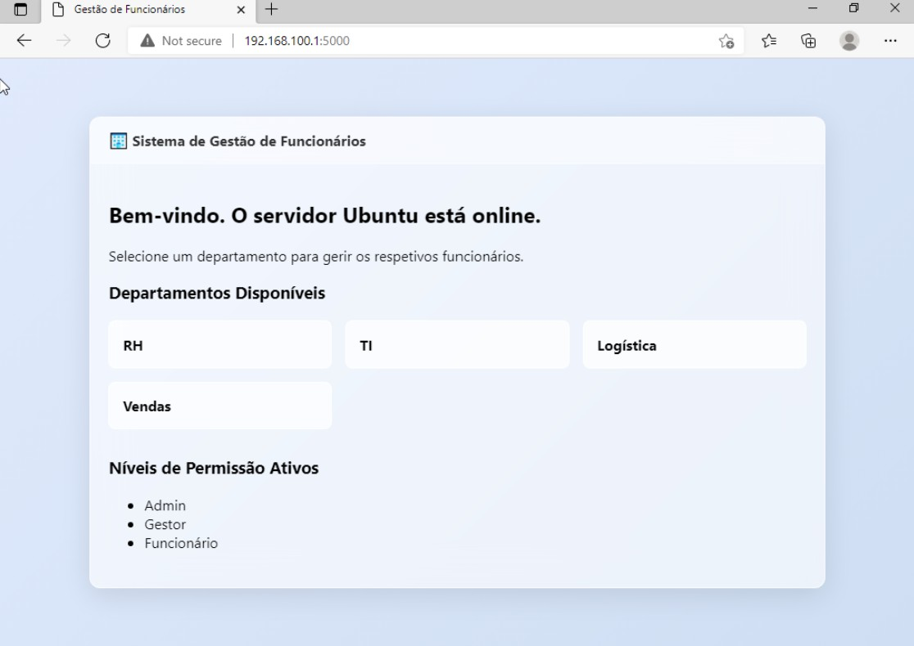
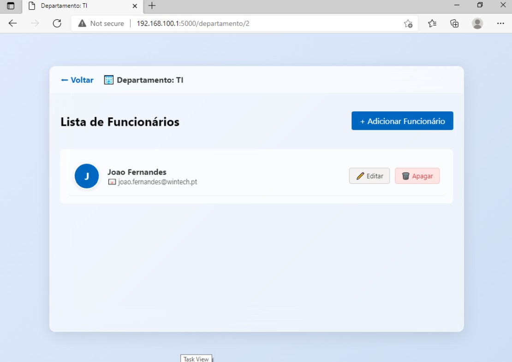

# 🏢 Enterprise HR Management System (Self-Hosted)

> **Resumo:** Sistema de gestão de funcionários self-hosted com infraestrutura de rede isolada, base de dados PostgreSQL e interface inspirada no Windows 11 Fluent Design.

**Tags:** #ITInfrastructure #Python #Flask #PostgreSQL #LinuxAdmin #SelfHosted #Networking #AuchanPortugal

---

Este projeto consiste numa solução completa de gestão de recursos humanos, integrando infraestrutura de redes, base de dados relacional e uma interface moderna. Foi desenvolvido para operar num ambiente de servidor isolado, garantindo a máxima segurança e autonomia na gestão de dados críticos através de um ecossistema independente.

A arquitetura de rede foi desenhada para simular um cenário empresarial real, onde o servidor Ubuntu atua como gateway, gerindo o tráfego entre a rede externa e um segmento de LAN privado. Através da implementação de um servidor DHCP nativo, garantimos a conectividade automática e segura para as estações de trabalho clientes dentro do mesmo segmento.

No coração do sistema encontra-se uma base de dados PostgreSQL, estruturada com integridade referencial para gerir funcionários, departamentos e níveis de permissão de forma eficiente. Esta escolha tecnológica permite uma escalabilidade robusta e a execução de consultas complexas, fundamentais para a manutenção da consistência dos dados da organização.

A aplicação foi construída em Python utilizando a framework Flask, focando-se em funções fundamentais e lógica simplificada para garantir uma manutenção facilitada e alta performance. A lógica de negócio está estritamente isolada das camadas de apresentação, seguindo os princípios de desenvolvimento modular e as melhores práticas de engenharia de software.

A interface de utilizador adota o Fluent Design, inspirado no Windows 11, proporcionando uma experiência de utilização fluida e visualmente apelativa através de efeitos avançados de transparência e desfoque. O objetivo foi criar um sistema altamente funcional que, ao mesmo tempo, fosse intuitivo e esteticamente integrado no ecossistema digital moderno.

A persistência do serviço é assegurada através da criação de daemons de sistema (Systemd) no Ubuntu, permitindo que a aplicação se recupere automaticamente de eventuais falhas ou reinícios. Todo o processo de deployment é facilitado por scripts de automação interativos, permitindo replicar esta infraestrutura em qualquer servidor Linux em poucos minutos.

---

### 🖼️ Demonstração do Projeto

---

### 📂 Estrutura do Repositório

Para facilitar a compreensão e a manutenção do sistema, o repositório está organizado da seguinte forma:

* **`app/`**: Contém o núcleo da aplicação, incluindo os modelos de dados (`models.py`), ficheiros estáticos (CSS/Imagens) e os templates HTML.
* **`scripts/`**: Suite de automação em Bash para configuração de rede (`setup_network.sh`), instalação de dependências (`setup_app.sh`) e criação do serviço de sistema (`setup_service.sh`).
* **`sql/`**: Inclui o ficheiro `schema.sql`, responsável por criar toda a estrutura de tabelas e dados iniciais na base de dados PostgreSQL.
* **`.env.example`**: Guia para configuração de variáveis de ambiente, permitindo ao utilizador configurar as suas próprias credenciais de forma segura.
* **`.gitignore`**: Define as regras de exclusão para o Git, impedindo a partilha de ficheiros sensíveis (como passwords) ou pastas temporárias do ambiente virtual.
* **`run.py`**: Ponto de entrada da aplicação Flask, responsável por inicializar o servidor web e as rotas principais do sistema.
* **`README.md`**: Documentação técnica detalhada e guia de infraestrutura do projeto.
* **`projeto_gestao_funcionarios*.jpg`**: Capturas de ecrã demonstrativas da interface e funcionalidades implementadas.

---

### 👨‍💻 Desenvolvido por
**João Fernandes** 
